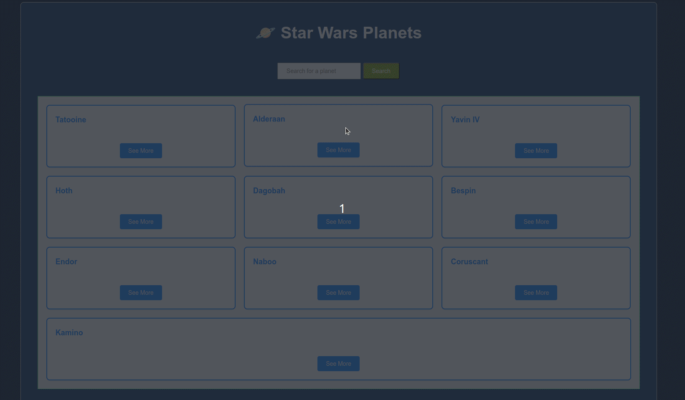

#  星球大战行星 



## 🌠[](https://github.com/SamuelRocha91/javascriptStarWarsPlanets/blob/main/README.md) [](https://github.com/SamuelRocha91/javascriptStarWarsPlanets/blob/main/README_SP.MD) [](https://github.com/SamuelRocha91/javascriptStarWarsPlanets/blob/main/README_EN.MD) [](https://github.com/SamuelRocha91/javascriptStarWarsPlanets/blob/main/README_Ñзык.md) [](https://github.com/SamuelRocha91/javascriptStarWarsPlanets/blob/main/README_å语.md) [](https://github.com/SamuelRocha91/javascriptStarWarsPlanets/blob/main/README_ar.md)

## 描述

这个项目是一个网络应用程序，展示了星球大战宇宙中的行星信息，利用了 [SWAPI（星球大战API）](https://swapi.dev/)。该应用程序允许用户查看行星列表，获取特定行星的详细信息，以及查看其居民的信息。

## 功能

- 列出API中所有可用的行星。
- 通过名称搜索行星。
- 显示行星的详细信息，包括气候、人口和地形。
- 显示每个行星居民的信息。

## 使用的技术

- HTML
- CSS
- JavaScript
- Fetch API

## 项目结构

```
/star-wars-planets
│
├── index.html         # 主HTML文件
├── style.css          # 样式表
├── main.js            # 应用程序逻辑
└── icons/
    └── planetas.png   # 应用图标
```

## 如何运行项目

1. 克隆这个仓库：
   ```bash
   git clone git@github.com:SamuelRocha91/javascriptStarWarsPlanets.git
   ```
2. 导航到项目目录：
   ```bash
   cd javascriptStarWarsPlanets
   ```
3. 在浏览器中打开 `index.html` 文件。

## 使用方法

- 页面加载时，将显示行星列表。
- 点击“See More”查看行星的详细信息。
- 使用搜索框按名称查找特定行星。

## 其他初学者项目

以下是我在成为开发者初期开发的其他项目：

- [二进制转换器](https://github.com/SamuelRocha91/Bin2Dec)
- [像素艺术](https://github.com/SamuelRocha91/PixelsArt)
- [待办事项列表](https://github.com/SamuelRocha91/TodoList)
- [计算器](https://github.com/SamuelRocha91/calculator)
- [表情生成器](https://github.com/SamuelRocha91/memeGenerator)
```