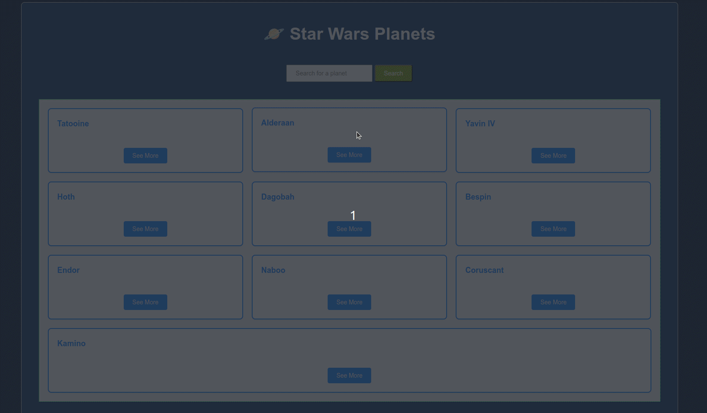

#  Планеты Звездных Войн 



## 🌐 
[](https://github.com/SamuelRocha91/javascriptStarWarsPlanets/blob/main/README.md) 
[](https://github.com/SamuelRocha91/javascriptStarWarsPlanets/blob/main/README_es.md) 
[](https://github.com/SamuelRocha91/javascriptStarWarsPlanets/blob/main/README_en.md) 
[](https://github.com/SamuelRocha91/javascriptStarWarsPlanets/blob/main/README_ru.md) 
[](https://github.com/SamuelRocha91/javascriptStarWarsPlanets/blob/main/README_ch.md) 
[](https://github.com/SamuelRocha91/javascriptStarWarsPlanets/blob/main/README_ar.md)

<details>
<summary><h2>Описание</h2></summary>

Этот проект представляет собой веб-приложение, которое отображает информацию о планетах во вселенной Звездных Войн, используя [SWAPI (Star Wars API)](https://swapi.dev/). Приложение позволяет пользователям просматривать список планет, получать подробности о конкретной планете и видеть информацию о ее обитателях.

</details>

<details>
<summary><h2>Функциональность</h2></summary>

Приложение позволяет пользователям:

- Список всех планет, доступных в API.
- Поиск планет по имени.
- Отображение деталей планеты, включая климат, население и рельеф.
- Просмотр информации о жителях каждой планеты.

</details>

<details>
<summary><h2>Используемые технологии</h2></summary>

- HTML
- CSS
- JavaScript
- Fetch API

</details>

<details>
<summary><h2>Структура проекта</h2></summary>

```
/star-wars-planets
│
├── index.html         # Основной HTML файл
├── style.css          # Файл стилей
├── main.js            # Логика приложения
└── icons/
    └── planetas.png   # Иконка приложения
```

</details>

<details>
<summary><h2>Как запустить проект</h2></summary>

1. Клонируйте этот репозиторий:
   ```bash
   git clone git@github.com:SamuelRocha91/javascriptStarWarsPlanets.git
   ```
2. Перейдите в каталог проекта:
   ```bash
   cd javascriptStarWarsPlanets
   ```
3. Откройте файл `index.html` в браузере.

</details>

<details>
<summary><h2>Использование</h2></summary>

- При загрузке страницы будет отображен список планет.
- Вы можете нажать на "See More", чтобы увидеть детали планеты.
- Используйте строку поиска, чтобы найти конкретные планеты по имени.

</details>

<details>
<summary><h2>Другие проекты для начинающих</h2></summary>

Вот другие проекты, которые я разработал на начальных этапах своей карьеры разработчика:

- 🖥️ [Конвертер двоичных чисел](https://github.com/SamuelRocha91/Bin2Dec/blob/main/README_ru.md)
- 🎨 [Pixels Art](https://github.com/SamuelRocha91/PixelsArt/blob/main/README_ru.md)
- 📝 [Список дел](https://github.com/SamuelRocha91/TodoList/blob/main/README_ru.md)
- 🧮 [Калькулятор](https://github.com/SamuelRocha91/calculator/blob/main/README_ru.md)
- 🦖 [Генератор мемов](https://github.com/SamuelRocha91/memeGenerator/blob/main/README_ru.md)

</details>
